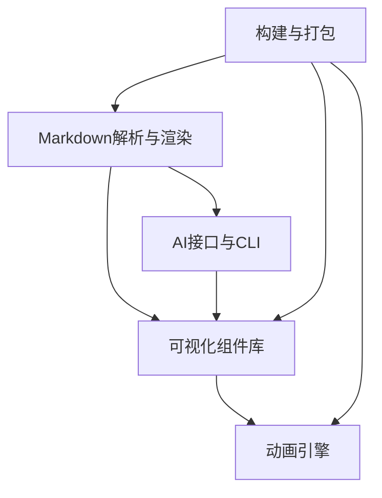

---

## 模块一：Markdown 解析与渲染引擎

### 职责
- 解析用户编写的 Markdown 文件（支持分页、代码块、数学公式、自定义组件标签）。
- 将解析结果转换为 Vue 组件树，生成可交互的幻灯片页面。
- 提供主题系统，支持全局样式与自定义主题。

### 技术选型
- **解析器**：`unified` + `remark` + 自定义插件（处理 `---` 分页、识别 `<Component />` 标签）。
- **渲染层**：Vue 3 动态组件。
- **主题**：CSS 变量 + 预设样式文件，支持用户覆盖。

### 核心设计
1. **分页处理**：  
   - 使用 `remark` 将 Markdown 解析为 AST，自定义插件遍历 AST，遇到 `---` 行时，将后续内容切割为独立页面。  
   - 每个页面内容存储为独立的 HTML 字符串或 Vue 模板片段。

2. **组件标签识别**：  
   - 自定义插件识别形如 `<ArrayViz :data="[1,2,3]" />` 的标签，将其替换为 Vue 组件占位符。  
   - 在运行时动态加载对应的 Vue 组件。

3. **渲染器**：  
   - 创建一个 `<SlideRenderer>` 组件，接收解析后的页面数据，利用 Vue 的 `v-html` 或动态组件渲染内容。  
   - 对于自定义组件，使用 `<component :is="componentName" v-bind="props" />` 动态挂载。

4. **主题系统**：  
   - 定义基础 CSS 变量（字体、颜色、间距），用户可提供自定义 CSS 文件覆盖。  
   - 内置 2-3 套预设主题（浅色、深色、护眼）。

### 关键挑战
- **组件标签的灵活解析**：需要支持 Vue 风格的 props 传递（对象、数组、字符串等），且要确保在 Markdown 中书写不破坏原有语法。  
  → 解决方案：使用正则匹配标签，提取组件名和 props JSON 字符串，再通过 `eval` 或 `Function` 安全解析（需沙箱隔离）。

- **性能**：解析大量 Markdown 页面时，避免重复解析。  
  → 解决方案：开发模式下监听文件变化，仅重新解析修改的页面；生产构建时预解析所有页面并生成静态 HTML。

### 实现步骤
1. 搭建基础项目结构，引入 `unified`、`remark`、`remark-html`。
2. 编写自定义插件 `remark-slide-split` 实现分页切割。
3. 编写自定义插件 `remark-component` 识别并替换组件标签。
4. 开发 Vue 渲染器组件，支持页面切换和动态组件加载。
5. 实现主题 CSS 变量与切换功能。

---

## 模块二：动画引擎

### 职责
- 提供统一的步骤管理器（`AnimationPlayer`），管理动画步骤队列、播放状态、速度控制。
- 封装底层动画库（Anime.js），提供简洁的 API 用于驱动 Canvas 渲染。
- 支持播放、暂停、步进、重置、调速等交互控制。

### 技术选型
- **动画库**：Anime.js（轻量，补间动画）。
- **Canvas 渲染**：原生 Canvas API，通过 `requestAnimationFrame` 驱动。
- **状态管理**：自研 `AnimationPlayer` 类，不依赖外部状态库。

### 核心设计
1. **步骤定义**：  
   每个步骤为一个对象，包含：
   - `type`：动作类型（如 `highlight`、`swap`、`move`）。
   - `params`：动作参数（如索引、颜色、位置）。
   - `duration`：动画时长（ms）。
   - `onStart`/`onComplete` 回调（可选）。

2. **播放器核心**：
   ```typescript
   class AnimationPlayer {
     steps: Step[];
     currentIndex: number;
     isPlaying: boolean;
     speed: number;
     
     play(): void;
     pause(): void;
     next(): void;
     prev(): void;
     setSpeed(speed: number): void;
     on(event: string, callback: Function): void;
   }
   ```

3. **动画执行**：  
   - 播放器从步骤队列中取出当前步骤，调用对应的 `renderer` 方法（如 `highlightElement`），通过 Anime.js 创建补间动画。
   - 动画结束后自动触发 `next()` 或等待用户交互。

4. **与组件通信**：  
   - 每个可视化组件（如 `ArrayViz`）内部维护一个 `AnimationPlayer` 实例，并暴露 `play`、`step` 等方法给父组件或控制栏。

### 关键挑战
- **动画与步骤同步**：确保步进时动画完全结束才进入下一步。  
  → 解决方案：每个动画返回 Promise，播放器等待 Promise resolve 后再执行下一步。

- **Canvas 性能**：大量元素频繁重绘可能导致卡顿。  
  → 解决方案：采用增量绘制（只重绘变化区域），或使用离屏 Canvas 缓存静态部分。

### 实现步骤
1. 定义 `Step` 接口和 `AnimationPlayer` 类骨架。
2. 实现基础控制方法（play, pause, next, prev）。
3. 集成 Anime.js，封装通用动画函数（如 `animatePosition`、`animateColor`）。
4. 实现步骤队列管理和事件系统。
5. 在可视化组件中集成播放器，并提供控制栏组件。

---

## 模块三：可视化组件库

### 职责
- 提供数组、树、图等常见数据结构的可视化组件。
- 每个组件支持通过 props 接收数据、步骤列表，并通过动画引擎播放步骤。
- 对外暴露统一的 API，方便扩展新的可视化类型。

### 技术选型
- **渲染**：Canvas（二维图形）。
- **布局算法**：自研或集成轻量布局库（如 `d3-hierarchy` 用于树布局）。

### 核心设计
1. **组件接口**（以 `ArrayViz` 为例）：
   ```typescript
   interface ArrayVizProps {
     data: number[];                 // 数组数据
     steps?: Step[];                // 可选步骤，若提供则播放器自动运行
     stepIndex?: number;            // 外部控制当前步骤
     config?: {                     // 样式配置
       barWidth?: number;
       barColor?: string;
       highlightColor?: string;
     };
   }
   ```

2. **渲染逻辑**：
   - 在 `onMounted` 中初始化 Canvas 和播放器。
   - 监听 `data` 变化，重新计算布局并绘制初始状态。
   - 播放器执行步骤时，调用具体的动画方法（如 `swapBars(i, j)`）驱动 Canvas 更新。

3. **动画方法**：
   - 每个组件提供一系列基础动画方法（`highlight`、`swap`、`move`），供步骤调用。
   - 这些方法内部使用 Anime.js 操作 Canvas 上的元素，保证动画流畅。

4. **布局算法**：
   - 数组：简单矩形条状图。
   - 树：递归布局，可集成 `d3-hierarchy` 的 `tree` 布局。
   - 图：力导向布局（可集成 `d3-force`）或预设位置。

### 关键挑战
- **Canvas 中的动画对象管理**：动画时需记录每个图形元素的当前属性，确保补间准确。  
  → 解决方案：维护一个图形对象数组，每个对象包含位置、颜色等属性，动画时更新这些属性并重绘。

- **树/图的复杂交互**：节点展开/折叠、路径高亮等。  
  → 解决方案：分阶段实现，先支持静态布局和基本动画，后续增加交互功能。

### 实现步骤
1. 创建基础 Canvas 组件封装（处理 resize、鼠标事件等）。
2. 实现 `ArrayViz`：绘制条形图，实现 `swap`、`highlight` 动画。
3. 实现 `TreeViz`：使用递归布局，实现节点高亮、边高亮。
4. 实现 `GraphViz`：使用力导向布局，实现节点/边高亮。
5. 编写组件文档和示例。

---

## 模块四：AI 接口与 CLI 工具

### 职责
- 定义动画步骤的 JSON Schema，作为 AI 生成动画的标准格式。
- 提供 CLI 工具，实现动画脚本的生成、验证、嵌入等功能。
- 预留 API，方便未来集成到在线编辑器或其他工具。

### 技术选型
- **CLI 框架**：Commander.js。
- **Schema 验证**：Ajv 或 Zod。
- **文件操作**：Node.js `fs` 模块。

### 核心设计
1. **JSON Schema 定义**：
   - 参考策划书中的示例，定义版本、类型、初始数据、步骤数组等字段。
   - 提供详细的说明和示例，供 AI 训练和调用时参考。

2. **CLI 命令**：
   ```bash
   algoflow generate --type array --description "冒泡排序" --output steps.json
   algoflow embed --md slides/sort.md --animation steps.json --tag "<ArrayViz />"
   algoflow validate steps.json
   algoflow preview steps.json
   ```
   - `generate`：调用 AI API（如 OpenAI）生成 JSON，或使用本地规则生成简单示例。
   - `embed`：读取 Markdown 文件，找到目标标签（如 `<ArrayViz />`），将 JSON 内容作为组件 prop 插入，或生成一个新的组件调用。
   - `validate`：使用 JSON Schema 验证文件合法性。
   - `preview`：启动一个简单 Web 服务，渲染动画 JSON，方便调试。

3. **AI 集成方式**：
   - 初期可提供简单的提示词模板，用户手动复制 AI 输出为 JSON 文件。
   - 后续可集成 OpenAI API，实现一键生成（需用户提供 API Key）。

### 关键挑战
- **AI 生成结果的准确性**：模型可能输出不符合 Schema 的 JSON。  
  → 解决方案：提供完善的错误提示和自动修复建议（如缺失字段补默认值）。

- **嵌入逻辑的鲁棒性**：Markdown 中可能有多个相同标签，需准确识别插入位置。  
  → 解决方案：通过标签的 `id` 或顺序索引定位，或允许用户指定行号。

### 实现步骤
1. 定义 JSON Schema 并编写示例文件。
2. 使用 Commander.js 搭建 CLI 框架，实现 `validate` 命令。
3. 实现 `embed` 命令：解析 Markdown，使用正则或 AST 操作插入内容。
4. 实现 `preview` 命令：创建临时 HTML 页面，加载动画引擎和 JSON 数据。
5. 可选：集成 AI API，实现 `generate` 命令（可后期扩展）。

---

## 模块五：构建与打包

### 职责
- 提供开发环境（热更新、调试）。
- 生产构建，生成可部署的静态网站。
- 支持导出 PDF（通过浏览器渲染）。

### 技术选型
- **构建工具**：Vite。
- **导出 PDF**：Puppeteer 或 Playwright（无头浏览器渲染 HTML 再转 PDF）。

### 核心设计
1. **开发环境**：
   - Vite 配置文件，入口为 `index.html`，引入 Vue 和主渲染器。
   - 监听 `slides/` 目录变化，自动重新解析并刷新页面。

2. **生产构建**：
   - Vite 打包生成 `dist/` 目录，包含所有静态资源。
   - 使用 `vite-plugin-html` 注入全局变量（如主题配置）。

3. **导出 PDF**：
   - 脚本启动无头浏览器，访问构建后的本地服务器，逐页截图或直接调用浏览器的打印功能。
   - 将每页转为 PDF 并合并。

### 关键挑战
- **动态组件加载**：生产构建需确保所有可能用到的组件都被打包。  
  → 解决方案：使用 Vite 的 `glob` 导入，或手动配置入口。

- **PDF 导出样式**：打印样式可能与屏幕显示不同。  
  → 解决方案：定义专门的 `@media print` 样式，隐藏控制栏，调整布局。

### 实现步骤
1. 配置 Vite 支持 Vue 和 Markdown 文件。
2. 编写开发服务器入口，动态解析 Markdown。
3. 编写构建脚本，生成静态站点。
4. 实现导出 PDF 脚本（基于 Puppeteer）。

---

## 模块间依赖关系



- **Markdown 解析器** 负责将用户内容转换为页面结构，并识别组件标签，因此依赖 **可视化组件库** 来动态加载。
- **可视化组件库** 依赖 **动画引擎** 来驱动步骤播放。
- **AI 接口与 CLI** 生成动画 JSON，并通过修改 Markdown 文件或直接注入组件 props，因此依赖 **Markdown 解析器** 和 **可视化组件库** 的定义。
- **构建与打包** 将所有模块整合为最终产品。

---
